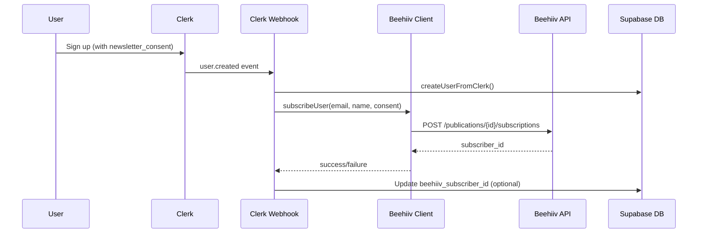

# Beehiiv Email Integration Plan

## Architecture




## Key Files to Modify/Create

| File | Action ||------|--------|| [`lib/beehiiv.ts`](lib/beehiiv.ts) | Create - API client || [`app/api/webhooks/clerk/route.ts`](app/api/webhooks/clerk/route.ts) | Modify - Add Beehiiv call || `.env.local` | Add - `BEEHIIV_API_KEY`, `BEEHIIV_PUBLICATION_ID` |---

## Phase 1: Infrastructure Setup (Parallelizable)

### 1A. Create Beehiiv API Client

Create `lib/beehiiv.ts` with:

- Type definitions for Beehiiv subscriber API
- `subscribeUser(email, firstName, lastName, utmSource?)` function
- `unsubscribeUser(email | subscriberId)` function
- Error handling with typed responses

### 1B. Environment Configuration

- Add `BEEHIIV_API_KEY` and `BEEHIIV_PUBLICATION_ID` to `.env.local`
- Add to `lib/env.ts` validation if it exists
- Document required Beehiiv API permissions (needs write access to subscribers)

---

## Phase 2: Core Webhook Integration (Sequential, depends on Phase 1)

### 2A. Extend Clerk Webhook

Modify [`app/api/webhooks/clerk/route.ts`](app/api/webhooks/clerk/route.ts):

```typescript
if (type === "user.created") {
  // ... existing user creation code ...
  
  // Add Beehiiv subscription
  const newsletterConsent = data.unsafe_metadata?.newsletter_consent
  if (newsletterConsent) {
    await subscribeToBeehiiv({
      email,
      firstName: data.first_name,
      lastName: data.last_name,
      utmSource: 'app_signup'
    })
  }
}
```


### 2B. Handle Email Updates

When `user.updated` fires with a new email, update Beehiiv subscriber.---

## Phase 3: Enhanced Features (Parallelizable, depends on Phase 2)

### 3A. Database Tracking (Optional)

Add `beehiiv_subscriber_id` column to `users_sync` table for:

- Faster unsubscribe operations
- Tracking subscription status locally

### 3B. Unsubscribe API Endpoint

Create `app/api/beehiiv/unsubscribe/route.ts`:

- Authenticated endpoint for users to unsubscribe
- Called from user settings page

### 3C. Retry Logic

Add retry mechanism in `lib/beehiiv.ts` for transient failures:

- 3 retries with exponential backoff
- Log failures to `clerk_webhook_events` table

---

## Phase 4: Testing and Monitoring (Sequential, depends on Phase 3)

### 4A. Logging

- Add structured logging for Beehiiv API calls
- Log subscriber creation success/failure to existing audit table

### 4B. Error Alerts

- Add console warnings for missing API keys in dev
- Graceful degradation if Beehiiv is unavailable

---

## Environment Variables Required

```bash
BEEHIIV_API_KEY=your_api_key_here
BEEHIIV_PUBLICATION_ID=pub_xxxxxxxx
```