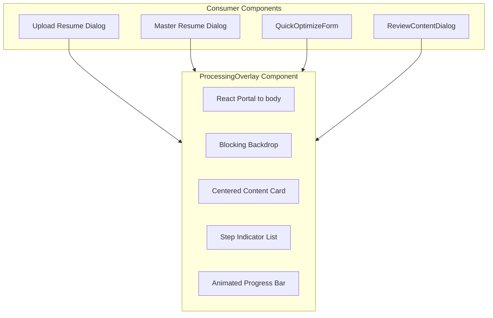

# Processing Overlay UX System

## Summary

Create a polished, full-screen overlay system that communicates background process status to users while preventing navigation/interaction. The design will feature:

- Step-based progress indicator with animated transitions
- Subtle pulse/gradient animations  
- Process-specific messaging
- Blocking overlay to prevent accidental navigation

---

## Phase 1: Core Component Design and Implementation

Build the reusable `ProcessingOverlay` component with all visual elements.**Key Files:**

- Create [`components/ui/processing-overlay.tsx`](components/ui/processing-overlay.tsx) - main overlay component
- Update [`app/globals.css`](app/globals.css) - add keyframe animations

**Component API:**

```tsx
interface ProcessingOverlayProps {
  isOpen: boolean
  title: string
  steps: { label: string; status: 'pending' | 'active' | 'completed' }[]
  currentStepIndex: number
  progress?: number // 0-100, optional for determinate progress
  icon?: React.ReactNode
}
```

**Visual Design:**

- Full viewport overlay with `fixed inset-0 z-50`
- Semi-transparent backdrop with blur (`bg-background/80 backdrop-blur-sm`)
- Centered card with gradient border animation
- Step list with checkmarks, spinners, and pending states
- Animated progress bar
- Pulsing icon/logo at top

---

## Phase 2: Upload Flow Integration

Integrate overlay into both resume upload dialogs.**Files to modify:**

- [`components/dashboard/upload-resume-dialog.tsx`](components/dashboard/upload-resume-dialog.tsx)
- [`components/dashboard/master-resume-dialog.tsx`](components/dashboard/master-resume-dialog.tsx)

**Steps to show:**

1. Uploading file
2. Processing document
3. Extracting content
4. Finishing up

---

## Phase 3: Optimization Flow Integration

Integrate overlay into the optimization workflow.**Files to modify:**

- [`components/dashboard/QuickOptimizeForm.tsx`](components/dashboard/QuickOptimizeForm.tsx)
- [`components/optimization/ReviewContentDialog.tsx`](components/optimization/ReviewContentDialog.tsx)

**Steps for extraction (QuickOptimizeForm):**

1. Reading your resume
2. Extracting work experience
3. Preparing review

**Steps for optimization (ReviewContentDialog):**

1. Analyzing job requirements
2. Optimizing content
3. Calculating match score
4. Finalizing resume

---

## Phase 4: Polish and Edge Cases

- Add escape-to-cancel support with confirmation
- Add timeout handling with retry option
- Add error state display within overlay
- Ensure mobile responsiveness
- Add reduced-motion support for accessibility

---

## Architecture

