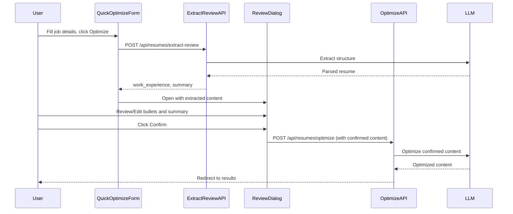

# Resume Content Review Before Optimization

## Architecture Overview

## Phase 1: Backend - Extract Review API (Independent)

Create a new API endpoint that extracts and returns work experience + summary for user review.**Files to create:**

- `app/api/resumes/extract-review/route.ts` - New endpoint

**Key implementation:**

- Reuse existing `extractResumeWithLLM` from [`lib/llm-resume-extractor.ts`](lib/llm-resume-extractor.ts)
- Return only `workExperience` array and `summary` string
- Cache extracted structure using existing `saveParsedStructure` from [`lib/db.ts`](lib/db.ts)

---

## Phase 2: Frontend - Review Dialog Component (Parallel with Phase 1)

Create a reusable dialog component for reviewing and editing extracted content.**Files to create:**

- `components/optimization/ReviewContentDialog.tsx` - Main dialog
- `components/optimization/WorkExperienceEditor.tsx` - Work experience editing sub-component

**Key features:**

- Display all work experience entries with editable bullet points
- Display editable professional summary (if present)
- Add/remove bullet points per work experience
- Validation before confirm (no empty bullets)

---

## Phase 3: Backend - Modify Optimize API (Depends on Phase 1)

Modify existing optimize endpoint to accept pre-confirmed work experience and summary.**Files to modify:**

- [`app/api/resumes/optimize/route.ts`](app/api/resumes/optimize/route.ts)

**Key changes:**

- Accept optional `work_experience` and `summary` fields in request body
- If provided, merge with cached/extracted structure (keep contact, education, skills, etc.)
- If not provided, fall back to existing extraction flow (backward compatible)

---

## Phase 4: Frontend - QuickOptimizeForm Integration (Depends on Phase 1, 2, 3)

Modify the optimize form to use the new two-step flow.**Files to modify:**

- [`components/dashboard/QuickOptimizeForm.tsx`](components/dashboard/QuickOptimizeForm.tsx)

**Key changes:**

- Add state for extracted content and review dialog
- Change submit handler to call extract-review first
- Open review dialog with extracted content
- Handle confirm callback to call optimize with confirmed content

---

## Phase 5: Testing and Error Handling (Sequential after Phase 4)

Ensure robust error handling and test the complete flow.**Files to modify:**

- All files from previous phases (error handling improvements)