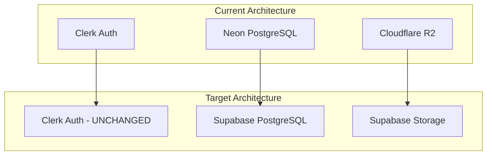
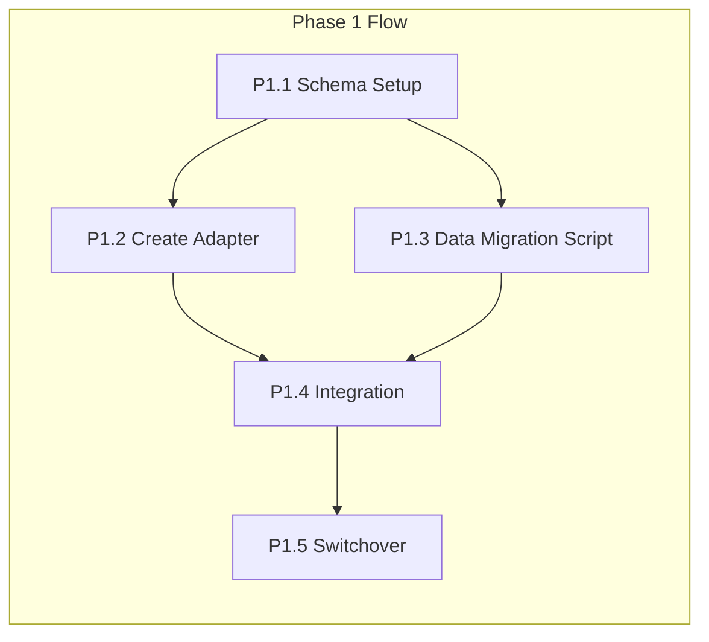
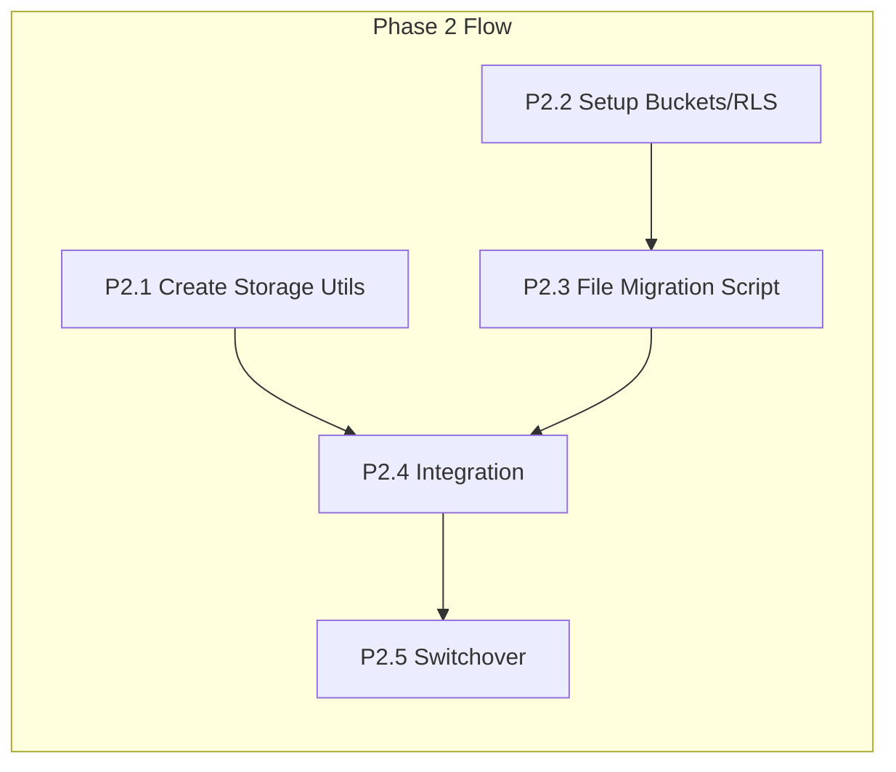
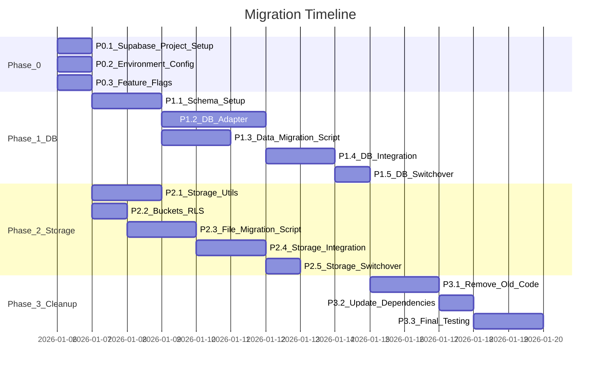

# Supabase Database + Storage Migration Plan

## Architecture Overview




## Scope

| Component | Action | Files Affected ||-----------|--------|----------------|| Database | Migrate Neon → Supabase | 6 core files || Storage | Migrate R2 → Supabase Storage | 3 core files || Auth | **NO CHANGES** - Keep Clerk | 0 files || Frontend | **NO CHANGES** | 0 files |---

## Phase 0: Setup and Preparation

**Goal:** Set up Supabase infrastructure and feature flags for safe rollout.**Can be parallelized:** Yes (P0.1-P0.3 can run in parallel)

### Files to Create/Modify

- Create `lib/supabase.ts` - Supabase client singleton
- Modify `lib/env.ts` - Add Supabase env vars
- Create `lib/feature-flags.ts` - Migration feature flags

### Environment Variables to Add

```javascript
SUPABASE_URL=https://xxx.supabase.co
SUPABASE_ANON_KEY=xxx
SUPABASE_SERVICE_ROLE_KEY=xxx
NEXT_PUBLIC_SUPABASE_URL=xxx
NEXT_PUBLIC_SUPABASE_ANON_KEY=xxx
USE_SUPABASE_DB=false
USE_SUPABASE_STORAGE=false
```

---

## Phase 1: Database Migration

**Goal:** Migrate all database operations from Neon to Supabase PostgreSQL.**Dependency:** Phase 0 must be complete.




### Files to Modify

- [`lib/db.ts`](lib/db.ts) - Add Supabase SQL client alongside Neon
- [`prisma/schema.prisma`](prisma/schema.prisma) - Remove `neon_auth` schema dependency
- [`lib/env.ts`](lib/env.ts) - Add Supabase database validation

### Files to Create

- `lib/supabase-db.ts` - Supabase database adapter
- `scripts/migrate-data-to-supabase.ts` - Data migration script

### Key Changes in [`lib/db.ts`](lib/db.ts)

The file currently uses Neon's template literal SQL:

```typescript
// Line 1-18: Current Neon implementation
import { neon } from "@neondatabase/serverless"
const sql = neon(databaseUrl)
```

Will be refactored to support both with feature flag:

```typescript
import { neon } from "@neondatabase/serverless"
import { createClient } from "@supabase/supabase-js"
import { getFeatureFlags } from "./feature-flags"

const sql = getFeatureFlags().USE_SUPABASE_DB 
  ? createSupabaseSQL() 
  : createNeonSQL()
```

---

## Phase 2: Storage Migration

**Goal:** Migrate file storage from Cloudflare R2 to Supabase Storage.**Dependency:** Phase 0 must be complete. Can run parallel to Phase 1.




### Files to Modify

- [`lib/r2.ts`](lib/r2.ts) - Add feature flag to route to Supabase
- [`lib/storage.ts`](lib/storage.ts) - Add Supabase storage client
- [`lib/env.ts`](lib/env.ts) - Make R2 vars optional when using Supabase

### Files to Create

- `lib/supabase-storage.ts` - Supabase Storage utilities
- `scripts/migrate-files-to-supabase.ts` - File migration script

### Supabase Storage Buckets to Create

| Bucket | Access | Purpose ||--------|--------|---------|| `resumes` | Private | User resume uploads || `exports` | Private | Generated DOCX/PDF files |---

## Phase 3: Integration and Cleanup

**Goal:** Validate migration, remove old code, update dependencies.**Dependency:** Phase 1 and Phase 2 complete and verified.

### Files to Modify

- [`lib/db.ts`](lib/db.ts) - Remove Neon code paths
- [`lib/r2.ts`](lib/r2.ts) - Remove R2 code paths
- [`lib/storage.ts`](lib/storage.ts) - Simplify to Supabase only
- [`lib/env.ts`](lib/env.ts) - Remove Neon/R2 env requirements
- `package.json` - Remove unused dependencies

### Dependencies to Remove

```json
{
  "@neondatabase/serverless": "remove",
  "@aws-sdk/client-s3": "remove",
  "@aws-sdk/s3-request-presigner": "remove"
}
```

---

## Parallel Execution Map



---