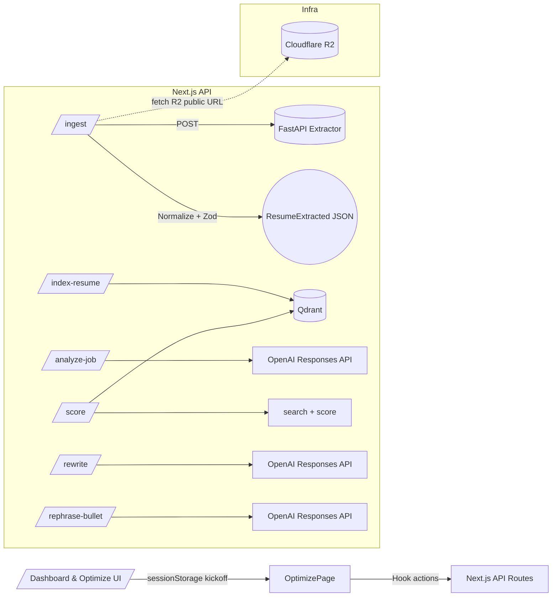

# Resumate – AI Resume Optimizer: Breakdown Implementation Plan

Date: 2025-09-27
Owner: Droid (Factory AI)

Note: Unable to pull latest from remote in this environment; plan is based on the current workspace snapshot.

## 1) Executive Summary

Implement a 3‑step, evidence‑bound resume optimization flow in the existing Next.js 14 app:
- Step 1: Select Master Resume + Analyze Job → Parse resume from Cloudflare R2 via an extractor, normalize to strict JSON, and analyze a pasted job description.
- Step 2: Optimize → Retrieve evidence via vector search (Qdrant), compute score and gaps, support quick paraphrase of chosen evidence bullets.
- Step 3: Generate Optimized Resume → Produce a tailored, editable resume using only selected evidence. Never invent claims; block if no evidence was selected.

This plan maps the spec to the repository, defines workstreams, acceptance criteria, testing, and risks. It respects “API-only AI calls,” JSON schema validation, and guards against hallucinations. [1]

## 2) Scope, Deliverables, and Acceptance Criteria

In-scope deliverables
- Services: Extractor (FastAPI) container; Qdrant; embeddings helper; search/match logic.
- API routes: `/api/ingest`, `/api/index-resume`, `/api/analyze-job`, `/api/score`, `/api/rewrite`, `/api/rephrase-bullet`.
- Client lib: typed API client; flow hook; kickoff transport.
- UI wiring: Dashboard → Generate kickoff; Optimize page with Step 2 and Step 3 behaviors.
- Guardrails: OCR fallback toast, missing must-haves confirm, schema validation errors → friendly UI with retry, writer rejects bullets without valid evidence_id, timeout/retry.

Out-of-scope (for this phase)
- PDF/DOCX export implementation (data model must support later addition).
- Advanced reranking, skill normalization lookups, diff view, versioning (listed as stretch).

Acceptance criteria mapping
- Dashboard → “Generate” kicks off parse, index, analyze, score, and navigates to Optimize with score, evidence, gaps populated. [1]
- Step 2 shows numeric score and breakdown; clicking requirement reveals supporting bullets with `evidence_id`. [1]
- Step 2 supports “rewrite from closest match” that paraphrases the chosen evidence only. [1]
- Step 3 generates a tailored resume using only evidence; request is blocked if no evidence selected. [1]
- Final resume is editable; future export does not require model changes. [1]
- All LLM outputs pass schema validation; on failure, show friendly error and retry. [1]
- Guardrails implemented: OCR toast; missing_must_haves confirm; writer rejects invalid evidence; timeouts surface retry; no infinite spinners. [1]

## 3) Architecture Overview

Core technologies
- Next.js 14 App Router + TypeScript; OpenAI Responses API with JSON Schema; Qdrant; Cloudflare R2; Zod; FastAPI extractor. [1][2]

Mermaid diagram

Runtime notes
- Keep all AI calls server-side in API routes; never from the browser. [1]
- Use JSON schema output for deterministic shapes; validate with Zod server-side. [1]
- Qdrant stores per-bullet vectors with `userId` payload filter.

## 4) Workstreams and Detailed Tasks

### 4.1 Environment & DevOps
- Add `.env.local` entries:
  - Cloudflare R2: `R2_ACCOUNT_ID`, `R2_ACCESS_KEY_ID`, `R2_SECRET_ACCESS_KEY`, `R2_BUCKET`
  - Extractor: `EXTRACTOR_URL`
  - OpenAI: `OPENAI_API_KEY`
  - Qdrant: `QDRANT_URL`, `QDRANT_API_KEY`
- Add `docker/docker-compose.yml` to run Qdrant and the extractor.
- Ensure Node runtime for API routes (not Edge) where OpenAI SDK/Qdrant client is used. [2]
- Repo uses npm per CLAUDE.md; prefer `npm run dev` over `pnpm dev`. Confirm standard command. [2]

### 4.2 Data Schemas & Types
- Add `lib/schemas.ts` with Zod schemas:
  - `ResumeExtractedSchema`, `JobProfileSchema`, subtypes for bullets/experiences.
- Export TS types for server and client.

### 4.3 Extractor Service (FastAPI)
- Containerize OCR-capable extractor with `ocrmypdf`, `pdfminer.six`, `pdfplumber`, and `mammoth` for DOCX.
- Endpoints: `POST /extract` (url or upload), `GET /health`.
- OCR fallback when PDF has insufficient text; return `text` and `tables` when possible.
- Show UI toast “Used OCR to read your PDF.” when OCR path triggered. [1]

### 4.4 Qdrant Setup
- Run local Qdrant via compose; create collection `resume_bullets` with vector size matching model `text-embedding-3-large` (3072) and cosine distance.
- Store payload: `{ userId, company, title, skills[], text }` and `id = evidence_id`.
- Filter by `userId` on search.

### 4.5 Embeddings Helper
- `lib/embeddings.ts` wraps OpenAI embeddings API for batch embed.
- Model: `text-embedding-3-large`. Handle retries and rate limits (basic exponential backoff).

### 4.6 Typed API Client (Browser)
- `lib/api.ts` with `fetchJson<T>` for typed calls to Next.js API routes.
- Methods: `ingestResume`, `indexResume`, `analyzeJob`, `scoreFit`, `rewriteResume`, `rephraseBullet`.

### 4.7 Evidence Search & Scoring
- `lib/match.ts` implements `searchEvidence(userId, queries, topK)` and `computeScore(job, evidence)`.
- Compute score blend: skills coverage, responsibilities coverage, domain signal, seniority; return per‑dimension breakdown and missing must‑haves.

### 4.8 API Routes
- `/api/ingest`: Calls extractor, normalizes to strict JSON via OpenAI Responses JSON Schema; append `evidence_id` to bullets; validate with Zod.
- `/api/index-resume`: Ensure collection, embed bullets, upsert points with payload.
- `/api/analyze-job`: Normalize job description into `JobProfile` via JSON Schema.
- `/api/score`: Use queries (must-have + top responsibilities), search Qdrant, compute score + missing.
- `/api/rewrite`: Two-pass writer: (1) produce resume with evidence ids; (2) strip ids; block if no evidence or if any bullet references unknown id.
- `/api/rephrase-bullet`: Controlled paraphrase against one bullet and target keyword.
- All routes: robust error handling, timeouts, friendly messages, and retry hints.

### 4.9 Flow Hook
- `hooks/useOptimizerFlow.ts`: Centralizes flow state, options (tone, length, emphasis, ATS), and actions:
  - `selectResume`, `setJobDescription`, `runAnalyzeJob`, `runOptimize`, `runRewrite`, `doRephrase`, `kickoffFromDashboard`.
- State guards `canOptimize` and `canRewrite` for UI enabling.

### 4.10 UI Wiring
- Dashboard kickoff:
  - `lib/kickoffTransport.ts` with `sessionStorage` stash/read/clear.
  - `app/dashboard/components/TargetJobCard.tsx` → “Generate” stashes userId, resumeKey, jobDescription then navigates to `/optimize`.
- Optimize page:
  - `app/optimize/page.tsx` bootstraps from stash, runs pipeline, renders Step2 + Step3.
  - Step 2 component: binds score, breakdown, evidence/gaps; supports “paraphrase” by calling `doRephrase(keyword, evidenceId)`.
  - Step 3 component: triggers `runRewrite()`, renders editable draft.
- Repo alignment:
  - Current repo has `app/dashboard/optimize/page.tsx` and optimization components. We’ll either (A) add `app/optimize` route as specified and link from Dashboard, or (B) reuse existing `app/dashboard/optimize` and mount the new Step2/Step3 inside existing page. Recommend (B) to minimize routing changes; adapt paths accordingly while keeping file names from the spec in `components/optimization/` where practical. [2]

### 4.11 Guardrails & UX States
- Toasters for success/error; confirm modal when `missing_must_haves.length` is high.
- Surface OCR toast when extractor indicates OCR path.
- Retry buttons on timeouts/5xx; never persistent spinners.
- Inputs disabled while `loading` state is true.

## 5) Repository Integration Map

Observed repo deltas vs spec
- Commands: Repo standard is npm (per CLAUDE.md); adjust local run docs to `npm run dev` and `docker compose ...`. [2]
- Existing pages/components:
  - Repo already has optimization-related components in `components/optimization/` and an Optimize route under `app/dashboard/optimize/`. We will wire new hook/actions into these rather than replacing established UI.
- API organization: Existing app has `/app/api/resumes/*` and `/app/api/jobs/*`. We will add the spec’s endpoints under `/app/api/*` as new routes to avoid breaking current APIs, then progressively integrate.
- Auth: Repo uses Clerk. Add server-side user identification to API routes; never accept client-supplied `userId` blindly. Use session to enforce per‑user isolation in Qdrant filters. [2]
- Edge runtime: Ensure routes using OpenAI SDK/Qdrant run on Node.

## 6) Testing & QA Plan

Automated tests
- Unit: `computeScore()` tests covering coverage ratios and edge cases.
- Integration: API route tests with mocked OpenAI/Qdrant/extractor; schema validation paths (happy/invalid JSON); rewrite rejects invalid evidence ids.
- Contract tests: ensure `lib/api.ts` types match API responses.

Manual/E2E checks
- Dashboard → Generate: full kickoff flows; evidence and gaps render; paraphrase updates evidence bullet text only.
- Step 3: Block when no evidence selected; otherwise produce draft; draft editable in UI.
- Guardrails: Simulate PDF without text (OCR toast), large missing must-haves (confirm), 5xx (retry surfaces), schema validation error (friendly message + retry).

Quality gates
- TypeScript strict compile clean; ESLint clean; route runtime errors monitored in dev console.

## 7) Milestones, Timeline, and Owners (indicative)

1) Env & Services (0.5–1d)
   - Compose for Qdrant + extractor; `.env.local` configuration; health checks.
2) Data Schemas & Helpers (0.5d)
   - `schemas.ts`, `embeddings.ts`, `api.ts`, `match.ts` scaffolding.
3) API Routes (1–1.5d)
   - Implement endpoints; JSON Schema formatting; Zod validation; error handling; auth context.
4) Flow Hook + Dashboard Kickoff (0.5–1d)
   - Hook state/actions; kickoff stash; `/optimize` bootstrap.
5) UI Wiring Step 2 (0.5–1d)
   - Score breakdown, evidence reveal, paraphrase; toasts and loading states.
6) UI Wiring Step 3 (0.5–1d)
   - Rewrite generation; block on missing evidence; editable draft rendering.
7) QA & Hardening (0.5–1d)
   - Tests, docs, timeouts/retries, logging, polish.

Total: ~4–7 days, depending on integration complexity with existing UI and auth.

## 8) Risks & Mitigations

- Embedding dimension mismatch → Ensure Qdrant collection vector size = 3072 (for `text-embedding-3-large`). Add assert on create. [1]
- Auth & multi‑tenancy → Always derive `userId` server-side; filter Qdrant by `userId`.
- Extractor OCR throughput → OCR is CPU-heavy; keep it local dev only; consider queue/rate limiting for prod.
- JSON schema drift → Keep strict schemas; on parse failure show friendly error and “Retry”.
- Model outputs → Pin models; log schema violations; consider retry with temperature=0.
- Command mismatch (pnpm vs npm) → Standardize on npm per repo guidance; avoid developer confusion. [2]
- Edge vs Node runtime → Force Node runtime for routes needing Node libs/SDKs. [2]

## 9) Implementation Notes & Conventions

- Evidence-only rule: Never fabricate claims; every generated bullet must cite a valid `evidence_id` during the draft stage.
- Keep bullets intact; do not split or invent content (UI and writer prompts reinforce this). [1]
- API-only AI calls; never expose OpenAI key to browser. [1]
- Zod on all inputs/outputs for runtime checks.
- Toasts via existing UI library (shadcn/ui) patterns.

## 10) Open Questions for John

1) Routing: Prefer reusing existing `app/dashboard/optimize/page.tsx` vs adding `/app/optimize/page.tsx`? Default recommendation is reuse existing route; confirm.
2) Commands: Confirm we should standardize on npm per CLAUDE.md (`npm run dev`) vs spec’s `pnpm dev`.
3) Cloudflare R2: Do we already have an R2 bucket and public domain enabled? Provide bucket/key naming conventions.
4) Auth: Confirm Clerk session → server `userId` wiring for all API routes.
5) Qdrant: OK to add Dockerized Qdrant to repo compose for local dev? Any preference for a managed Qdrant in non‑dev?
6) OpenAI model choices: Approve `gpt-4o-mini` for JSON schema generation and `text-embedding-3-large` for embeddings; any budget limits?
7) UI Ownership: Should Step2/Step3 be new components or integrated into existing `components/optimization/optimization-wizard.tsx`?
8) Error/Retry UX: Any preferred copy standards for toasts/modals? Existing design tokens to follow?

## 11) Definition of Done

- All acceptance criteria in Section 2 satisfied with manual verification.
- Automated tests for scoring and API schema validation in place and passing.
- No failing TypeScript or ESLint checks.
- Dev instructions updated (env vars, compose, run commands).
- PR raised with checklist and screenshots of Step 2 and Step 3.

## 12) Sources

[1] BUILD_SPEC.md (provided specification)

[2] CLAUDE.md (repo development and architecture guidance)

[3] Qdrant Documentation – https://qdrant.tech/documentation/

[4] OpenAI Responses API – https://platform.openai.com/docs/guides/responses

[5] Cloudflare R2 – https://developers.cloudflare.com/r2/

[6] pdfminer.six – https://github.com/pdfminer/pdfminer.six · pdfplumber – https://github.com/jsvine/pdfplumber · ocrmypdf – https://ocrmypdf.readthedocs.io/ · mammoth – https://github.com/mwilliamson/python-mammoth
